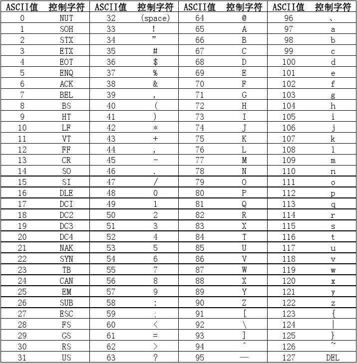

## 编码和解码的定义
现实世界中的汉字,英文字母和符号等在计算机中是无法直接存储和传输的,计算机所能识别的是01二进制数,所以需要维护某种映射规则,将现实世界的字符尽可能映射成某一个特定的码值(这个码值就可以转换成计算机可识别的二进制数)
这样映射的过程就是编码和解码,其中的映射规则就是字符集,不同的字符集所需的字节数不一致,也就诞生了不同的编码方式

## 常见的字符集(编码方式)
- ASCII
- UNICODE

## ASCII
ASCII规定了128个常见的字符映射,包含了控制符(LF换行,CR回车等),通信专用符(ACK等),字符,数字,大小写字母,标点符号,运算符号等 分别映射到十进制数0-127,其用一个字节存储,所以闲置了一位,被用来拓展其他国家自己的额外的字符
由于ASCII码能表示的字符过少且也只预留了128个(还是不够用),所以诞生了unicode字符集

## UNICODE
UNICODE是为了尽可能涵盖世界上全部的字符而诞生的,理论上全世界的人民都可以使用这套字符集,而避免各国拓展ASCII码带来的,字符集不统一,进而导致乱码问题,涵盖的字符更完整也使得一个字节所能描述的码值不够用,这也诞生了多种编码方式,
例如UTF-8,UTF-16,所以我们常用UTF-8等编码方式来进行沟通

### UTF-8
UTF-8使用1-4个字节来表示,兼容US-ASCII码,中文使用3个字节来编码,相比GBK等带来了占用更多字节的缺点
